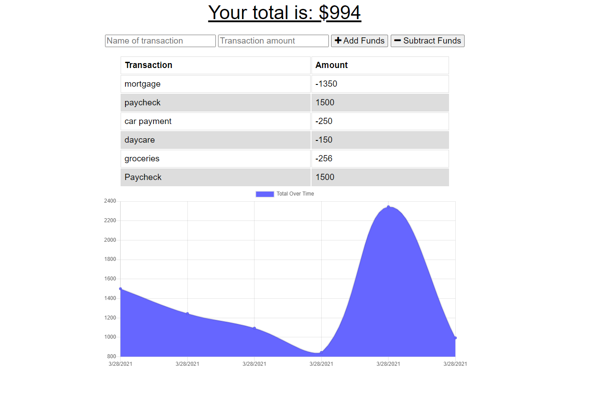

# Budget Tracker

## Description

A PWA that lets users track their money by adding expenses and deposits to their budget with offline capabilities.

## Table of Contents

* [Links](#Links)
* [Built With](#Built-With)
* [Questions](#Questions)

## Links

* Deployed Application: https://kenny-budget-tracker.herokuapp.com/
* GitHub Repo: https://github.com/kenneththelarson/budget-tracker

## Built With

* Node.js
* Express.js
* MongoDb
* IndexedDB

## Questions

Created by: [Kenny Larson](https://github.com/kenneththelarson)

For further question please contact [kenneththelarson@gmail.com](mailto:kenneththelarson@gmail.com)